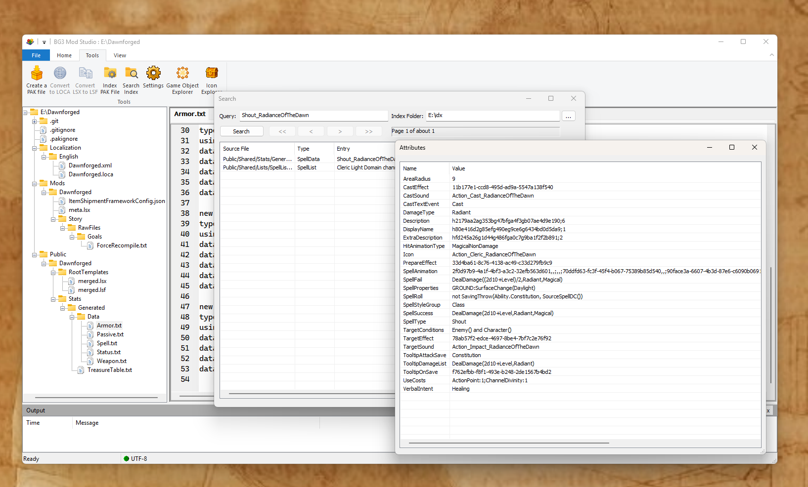

# BG3 Mod Studio

**BG3 Mod Studio** is a comprehensive Windows application for creating and editing mods for **Baldur's Gate 3**.

Built with modern C++20, WTL (Windows Template Library), and DirectX, it provides a fast, native Windows experience for BG3 modding.



---

## ✨ Features

**BG3 Mod Studio** is a multi-tab editor interface that provides:

- **Full-text indexing** with Xapian for lightning-fast search of PAK content (stats, spells, passives, localization)
- **RocksDB storage** for instant retrieval of icons and game objects
- **Text editors** with Scintilla-based syntax highlighting
- **Image viewers** with Direct2D rendering (DDS, PNG, JPG, BMP, TGA, GIF, HDR)
- **GR2 model viewer** with Direct3D 11 rendering for 3D character and object models
- **PAK explorer** for browsing BG3 PAK files **without** extraction
- **LSF viewer** for inspecting Larian's LSF files
- **Game Object explorer** for inspecting and searching game data
- **Icon explorer** for browsing and searching game icons
- **PAK Generator** for building and packaging mods
---

## 🛠️ Building from Source

### Requirements
- **Visual Studio 2022** with C++20 support
- **Windows 10 SDK** (10.0.19041.0 or later)
- **vcpkg** for dependency management
- **Git** with submodule support

### Build Steps

1. Clone with submodules:
   ````bash
   git clone --recurse-submodules https://github.com/trieck/BG3ModMaker.git
   cd BG3ModMaker