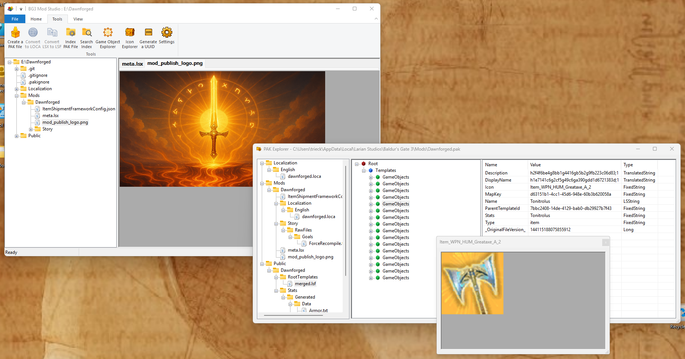

# BG3 Mod Studio

**BG3 Mod Studio** is a comprehensive Windows application for creating and editing mods for **Baldur's Gate 3**.

Built with modern C++20, WTL (Windows Template Library), and DirectX, it provides a fast, native Windows experience for BG3 modding.

---

## ✨ Features

**BG3 Mod Studio** is a multi-tab editor interface that provides:

- **Full-text indexing** with Xapian for lightning-fast search of PAK content (stats, spells, passives, localization)
- **RocksDB storage** for instant retrieval of icons and game objects
- **Text editors** with Scintilla-based syntax highlighting
- **Image viewers** with Direct2D rendering (DDS, PNG, JPG, BMP, TGA, GIF, HDR)
- **GR2 model viewer** with Direct3D 11 rendering for 3D character and object models
- **PAK explorer** for browsing BG3 PAK files **without** extraction
- **LSF viewer** for inspecting Larian's LSF files
- **Game Object explorer** for inspecting and searching game data
- **Icon explorer** for browsing and searching game icons
- **PAK Generator** for building and packaging mods
- **Osiris Viewer** for viewing Osiris goals, functions, types, enums and databases
---
## Build Instructions (Windows)

### Prerequisites

- Windows 10 or Windows 11 (x64)
- Visual Studio 2022/2026
  - Workload: Desktop development with C++  
  - Components:
    - MSVC v143
    - Windows 10/11 SDK
- Git
- Microsoft vcpkg

---

### 1. Clone the Repository (with Submodules)

    git clone --recurse-submodules https://github.com/trieck/BG3ModStudio.git
    cd BG3ModStudio

If already cloned without submodules:

    git submodule update --init --recursive

---

### 2. Install Dependencies via vcpkg

Ensure `VCPKG_ROOT` is set to your vcpkg installation directory.

    vcpkg install --triplet x64-windows

All dependencies are declared in `vcpkg.json`.

---

### 3. Integrate vcpkg with Visual Studio

    vcpkg integrate install

---

### 4. Open the Solution

Open the following file in Visual Studio 2022/2026:

    BG3ModStudio.slnx

---

### 5. Select Build Configuration

- Configuration: Debug or Release  
- Platform: x64  

---

### 6. Build

From Visual Studio:

    Build → Build Solution

or press:

    Ctrl + Shift + B

---

### 7. Run

The executable will be generated in:

    x64/[Debug|Release]/BG3ModStudio.exe
---

## License

BG3 Mod Studio’s original source code is licensed under the MIT License.
The distributed application includes third-party components licensed
under the GNU GPL v2 or later, and redistribution of the combined
application is subject to the GNU GPL v2 or later.

See [THIRD_PARTY_LICENSES.md](licenses/THIRD_PARTY_LICENSES.md) for details.
